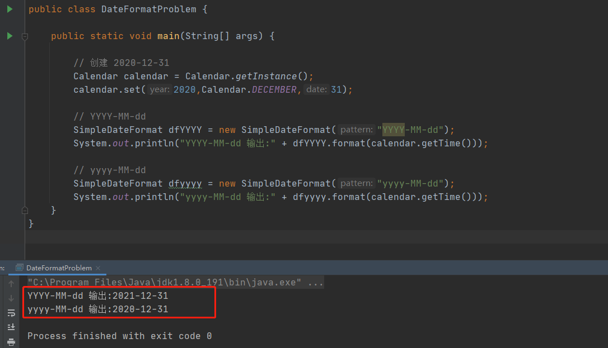
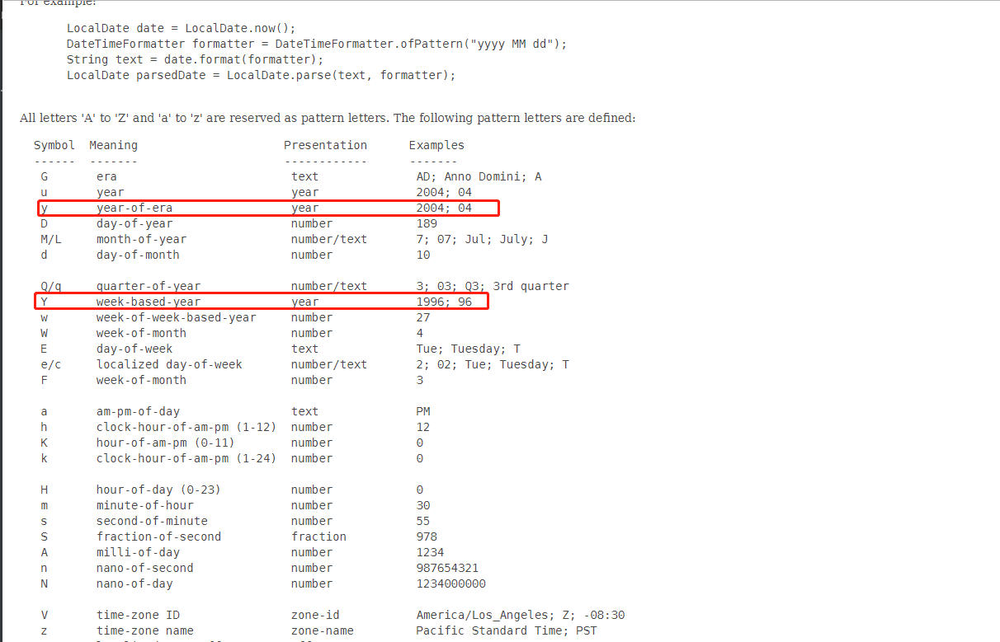

##YYYY-MM-dd引起的日期错误

新的一年新的希望，但是由此引发的问题也还是要处理！[手动滑稽]
###1.问题重现
        // 创建 2020-12-31
        Calendar calendar = Calendar.getInstance();
        calendar.set(2020,Calendar.DECEMBER,31);

        // YYYY-MM-dd
        SimpleDateFormat dfYYYY = new SimpleDateFormat("YYYY-MM-dd");
        System.out.println("YYYY-MM-dd 输出:" + dfYYYY.format(calendar.getTime()));

        // yyyy-MM-dd
        SimpleDateFormat dfyyyy = new SimpleDateFormat("yyyy-MM-dd");
        System.out.println("yyyy-MM-dd 输出:" + dfyyyy.format(calendar.getTime()));
        
 输出信息： 
 
 可以看到 YYYY-MM-dd 输出的时间是2021-12-31.正确的输出格式应该是“2020-12-31”；  

###2.翻车原因
为什么“YYYY-MM-dd”格式化日期“2020-12-31”时，打印的结果是错误的“2021-12-31”呢？
我们可以从官方文档对javase8版本对java.time.format的介绍中找到答案！打开地址（https://docs.oracle.com/javase/8/docs/api/java/time/format/DateTimeFormatter.html#patterns ）

YYYY使用的是week-based-year，一周属于的年份：一周从周日开始周六结束，只要本周跨年则本周就属于下一年。

###3.如何避免？
解决这个问题其实很简单，只要将"YYYY-MM-dd"改为"yyyy-MM-dd";但是为了避免出现将yyyy误写为YYYY同时防止一个项目中多次定义，建议定义一个专门的DateUtil类，
将常用的日期格式都提供好，禁止其他地方定义。

